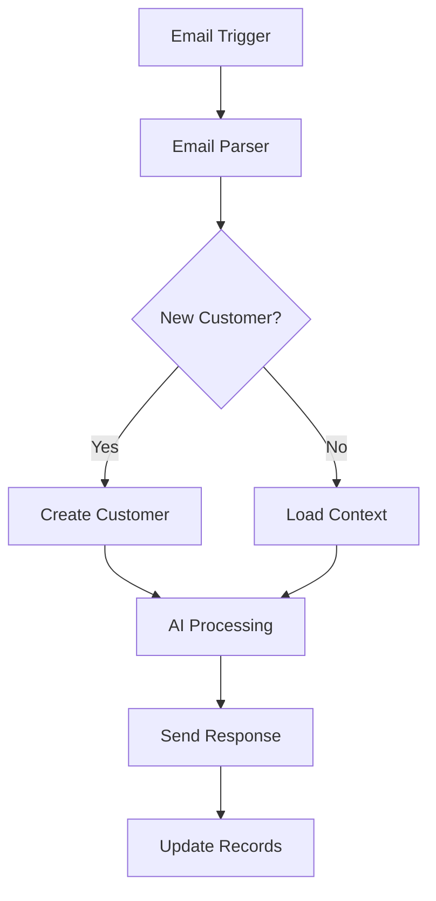

# Email AI Chat System with n8n - Complete Tutorial

> **Transform your email account into an intelligent customer interaction hub that handles inquiries 24/7, provides product information, and guides customers toward purchases.**

## Table of Contents
- [Overview](#overview)
- [Prerequisites](#prerequisites)
- [Architecture](#architecture)
- [Phase 1: Basic Setup](#phase-1-basic-setup)
- [Phase 2: Enhanced Features](#phase-2-enhanced-features)
- [Phase 3: Advanced Analytics](#phase-3-advanced-analytics)
- [Configuration Details](#configuration-details)
- [Troubleshooting](#troubleshooting)
- [Maintenance](#maintenance)

## Overview

This system creates a conversational AI that:
- 📧 Monitors your email inbox for customer inquiries
- 🤖 Generates intelligent, contextual responses using AI
- 📊 Tracks customer journey and conversation stages
- 💾 Maintains customer context across conversations
- 📈 Guides customers toward purchases and outcomes
- 🔄 Handles follow-ups and nurturing automatically

## Prerequisites

### Required Services
- **n8n** (Cloud or Self-hosted) - Workflow automation
- **Airtable** - Customer and knowledge database
- **OpenAI API** - AI response generation
- **Email Account** - Business email with IMAP/SMTP access

### Estimated Costs
- n8n Cloud: $20-100/month (based on executions)
- Airtable: $0-20/month (Pro plan recommended)
- OpenAI API: $50-200/month (usage-based)
- **Total: $70-320/month**

### Technical Requirements
- Basic understanding of n8n workflows
- Email account with IMAP/SMTP access
- API keys for services

## Architecture



### Core Components
1. **Email Monitoring** - IMAP trigger for incoming emails
2. **Customer Management** - Airtable database for context
3. **AI Processing** - OpenAI for response generation
4. **Response System** - SMTP for sending replies
5. **Analytics** - Tracking and reporting

## Phase 1: Basic Setup

### Step 1: Email Trigger Configuration

#### 1.1 Create Email Trigger Node
```json
{
  "nodeType": "Email Trigger (IMAP)",
  "settings": {
    "host": "imap.yourdomain.com",
    "port": 993,
    "secure": true,
    "user": "support@yourdomain.com",
    "password": "[your-app-password]",
    "mailbox": "INBOX",
    "markSeen": true,
    "pollInterval": 60
  }
}
```

#### 1.2 Common Email Provider Settings

**Gmail:**
```
Host: imap.gmail.com
Port: 993
SSL: true
Auth: App Password (not regular password)
```

**Outlook/Office365:**
```
Host: outlook.office365.com
Port: 993
SSL: true
```

**Custom Domain:**
```
Host: imap.yourdomain.com
Port: 993 (SSL) or 587 (STARTTLS)
SSL: true/false accordingly
```

### Step 2: Email Parser (Code Node)

#### 2.1 Email Parser Code
```javascript
// Email Parser - Extracts and structures email data
const emailData = $input.all()[0].json;

// Extract thread ID for conversation continuity
const threadId = emailData.messageId || 
  (emailData.references ? emailData.references.split(' ')[0] : null) ||
  emailData.subject.replace(/^(re:|fwd:)/i, '').trim();

// Extract customer information
const customerEmail = emailData.from?.address || emailData['return-path'];
const customerName = emailData.from?.name || 
  emailData.from?.address?.split('@')[0] || 'Unknown';

// Extract and clean message content
const subject = emailData.subject || 'No Subject';
let body = emailData.textPlain || emailData.text || emailData.html || '';
const cleanBody = body.replace(/<[^>]*>/g, '').replace(/\s+/g, ' ').trim();

// Determine if this is a reply
const isReply = !!(emailData.inReplyTo || emailData.references);

// Basic intent classification
function determineIntent(text) {
  const lowerText = text.toLowerCase();
  
  if (lowerText.match(/price|cost|quote|pricing|how much/)) {
    return 'pricing_inquiry';
  } else if (lowerText.match(/support|help|problem|issue|trouble/)) {
    return 'support_request';
  } else if (lowerText.match(/buy|purchase|order|checkout/)) {
    return 'purchase_intent';
  } else if (lowerText.match(/information|details|specs|features/)) {
    return 'information_request';
  } else if (lowerText.match(/demo|trial|test/)) {
    return 'demo_request';
  }
  return 'general_inquiry';
}

// Extract urgency indicators
function determineUrgency(text, subject) {
  const urgentKeywords = ['urgent', 'asap', 'emergency', 'critical', 'immediate'];
  const combined = (text + ' ' + subject).toLowerCase();
  return urgentKeywords.some(keyword => combined.includes(keyword));
}

return {
  // Core identifiers
  threadId,
  customerEmail,
  customerName,
  
  // Message content
  subject,
  body: cleanBody,
  originalBody: body,
  
  // Classification
  messageIntent: determineIntent(cleanBody),
  isReply,
  isUrgent: determineUrgency(cleanBody, subject),
  
  // Metadata
  timestamp: new Date().toISOString(),
  hasAttachments: !!(emailData.attachments?.length),
  
  // Raw data for reference
  rawEmail: emailData
};
```

### Step 3: Airtable Database Setup

#### 3.1 Create Airtable Base
**Base Name:** `Email AI System`

#### 3.2 Customers Table
```
Table: Customers
Fields:
- Email (Single line text) - Primary field
- Name (Single line text)
- Company (Single line text)
- Stage (Single select)
  Options: initial_inquiry, information_gathering, product_matching, 
           objection_handling, closing, customer, churned
- First Contact (Date & time)
- Last Contact (Date & time)
- Interaction Count (Number)
- Total Interactions (Rollup from Interactions table)
- Sentiment Score (Number - scale 0.0 to 1.0)
- Conversion Probability (Number - scale 0.0 to 1.0)
- Budget Range (Single line text)
- Timeline (Single line text)
- Notes (Long text)
- Tags (Multiple select)
```

#### 3.3 Interactions Table
```
Table: Interactions
Fields:
- Customer (Link to Customers)
- Thread ID (Single line text)
- Direction (Single select: inbound, outbound)
- Subject (Single line text)
- Message (Long text)
- Intent (Single select: pricing_inquiry, support_request, etc.)
- Timestamp (Date & time)
- Response Time (Number - minutes)
- AI Confidence (Number)
- Human Reviewed (Checkbox)
```

#### 3.4 Products Table
```
Table: Products
Fields:
- Product ID (Single line text) - Primary field
- Name (Single line text)
- Description (Long text)
- Price (Currency)
- Features (Long text)
- Use Cases (Long text)
- Category (Single select)
- Status (Single select: active, discontinued)
- Documentation Link (URL)
```

#### 3.5 Knowledge Base Table
```
Table: Knowledge Base
Fields:
- Question (Single line text) - Primary field
- Answer (Long text)
- Category (Single select)
- Keywords (Multiple select)
- Last Updated (Date & time)
- Usage Count (Number)
```

### Step 4: Customer Lookup and Management

#### 4.1 Customer Lookup Node (Airtable)
```json
{
  "operation": "List",
  "base": "[Your Base ID]",
  "table": "Customers",
  "filterByFormula": "({Email} = '{{$node[\"Email Parser\"].json[\"customerEmail\"]}}')",
  "returnFieldsByFieldId": false
}
```

#### 4.2 IF Node - New vs Existing Customer
```json
{
  "conditions": {
    "string": [
      {
        "value1": "={{$node[\"Customer Lookup\"].json.length}}",
        "value2": "0",
        "operation": "equal"
      }
    ]
  }
}
```

#### 4.3 Create New Customer (Airtable - True Branch)
```json
{
  "operation": "Append",
  "base": "[Your Base ID]",
  "table": "Customers",
  "fields": {
    "Email": "={{$node[\"Email Parser\"].json[\"customerEmail\"]}}",
    "Name": "={{$node[\"Email Parser\"].json[\"customerName\"]}}",
    "Stage": "initial_inquiry",
    "First Contact": "={{$node[\"Email Parser\"].json[\"timestamp\"]}}",
    "Last Contact": "={{$node[\"Email Parser\"].json[\"timestamp\"]}}",
    "Interaction Count": 1,
    "Sentiment Score": 0.5,
    "Conversion Probability": 0.1
  }
}
```

#### 4.4 Load Customer Context (Airtable - False Branch)
```json
{
  "operation": "Get",
  "base": "[Your Base ID]",
  "table": "Customers",
  "id": "={{$node[\"Customer Lookup\"].json[0].id}}"
}
```

### Step 5: AI Context Building

#### 5.1 Merge Customer Data (Merge Node)
```json
{
  "mode": "mergeByPosition",
  "joinMode": "enrichInput2"
}
```

#### 5.2 AI Context Builder (Code Node)
```javascript
// AI Context Builder - Prepares comprehensive context for AI
const emailData = $node["Email Parser"].json;
const customerPath = $node["IF"].json; // Will have customer data from either branch
const customerData = customerPath[0] || {};

// Build customer profile
const customerProfile = `
Customer Information:
- Name: ${customerData.Name || emailData.customerName}
- Email: ${customerData.Email || emailData.customerEmail}
- Company: ${customerData.Company || 'Unknown'}
- Conversation Stage: ${customerData.Stage || 'initial_inquiry'}
- Previous Interactions: ${customerData['Interaction Count'] || 0}
- Conversion Probability: ${customerData['Conversion Probability'] || 0.1}
- Sentiment Score: ${customerData['Sentiment Score'] || 0.5}
- Budget Range: ${customerData['Budget Range'] || 'Unknown'}
- Timeline: ${customerData.Timeline || 'Unknown'}
`;

// Message analysis
const messageAnalysis = `
Current Message:
- Intent: ${emailData.messageIntent}
- Is Reply: ${emailData.isReply}
- Is Urgent: ${emailData.isUrgent}
- Subject: ${emailData.subject}
- Content: ${emailData.body}
`;

// Context for AI
const aiPrompt = `${customerProfile}

${messageAnalysis}

Instructions:
1. Respond professionally and helpfully
2. Address the customer's specific intent
3. Move the conversation toward a purchase when appropriate
4. Ask qualifying questions to understand their needs
5. Provide specific product information when relevant
6. Keep response concise but complete
7. End with a clear next step or call-to-action

Generate a helpful response:`;

return {
  customerData,
  emailData,
  aiPrompt,
  context: {
    stage: customerData.Stage || 'initial_inquiry',
    intent: emailData.messageIntent,
    isReply: emailData.isReply,
    urgency: emailData.isUrgent
  }
};
```

### Step 6: AI Response Generation

#### 6.1 OpenAI Chat Node
```json
{
  "model": "gpt-4",
  "messages": [
    {
      "role": "system",
      "content": "You are a professional sales and support assistant for [Your Company Name]. Your goal is to help customers find the right solutions and guide them toward purchases. Be helpful, knowledgeable, and professional. Always aim to provide value and build trust."
    },
    {
      "role": "user", 
      "content": "={{$node[\"AI Context Builder\"].json[\"aiPrompt\"]}}"
    }
  ],
  "temperature": 0.7,
  "max_tokens": 500,
  "top_p": 1,
  "frequency_penalty": 0,
  "presence_penalty": 0
}
```

#### 6.2 Response Enhancement (Code Node)
```javascript
// Response Enhancement - Personalizes and formats the AI response
const aiResponse = $node["OpenAI"].json.choices[0].message.content;
const context = $node["AI Context Builder"].json;
const customerData = context.customerData;
const emailData = context.emailData;

// Personalize greeting
let greeting = `Hello`;
if (customerData.Name && customerData.Name !== 'Unknown') {
  greeting = `Hello ${customerData.Name}`;
} else if (emailData.customerName && emailData.customerName !== 'Unknown') {
  greeting = `Hello ${emailData.customerName}`;
}

// Add stage-specific call-to-actions
const stageActions = {
  'initial_inquiry': 'Would you like to schedule a quick call to discuss your specific needs?',
  'information_gathering': 'Based on what you\'ve shared, I can prepare a customized recommendation for you.',
  'product_matching': 'Would you like me to send you a detailed comparison of these options?',
  'objection_handling': 'I\'d be happy to address any concerns you might have.',
  'closing': 'I can hold this special pricing for you. Would you like to proceed?'
};

const callToAction = stageActions[context.context.stage] || 
  'How else can I help you today?';

// Format final response
const formattedResponse = `${greeting},

${aiResponse}

${callToAction}

Best regards,
[Your Name]
[Your Company]
[Contact Information]

---
This email was generated by our AI assistant. If you need immediate human assistance, please call [phone] or mark your email as urgent.`;

// Generate subject line
let subject = emailData.subject;
if (!subject.toLowerCase().startsWith('re:')) {
  subject = `Re: ${subject}`;
}

return {
  to: emailData.customerEmail,
  subject: subject,
  body: formattedResponse,
  htmlBody: formattedResponse.replace(/\n/g, '<br>'),
  aiResponse: aiResponse,
  confidence: 0.8 // You can implement confidence scoring
};
```

### Step 7: Send Email Response

#### 7.1 Send Email Node (SMTP)
```json
{
  "transport": "smtp",
  "host": "smtp.yourdomain.com",
  "port": 587,
  "secure": false,
  "auth": {
    "user": "support@yourdomain.com",
    "pass": "[your-smtp-password]"
  },
  "from": "Support Team <support@yourdomain.com>",
  "to": "={{$node[\"Response Enhancement\"].json[\"to\"]}}",
  "subject": "={{$node[\"Response Enhancement\"].json[\"subject\"]}}",
  "format": "html",
  "message": "={{$node[\"Response Enhancement\"].json[\"htmlBody\"]}}"
}
```

### Step 8: Update Customer Records

#### 8.1 Log Interaction (Airtable)
```json
{
  "operation": "Append",
  "base": "[Your Base ID]",
  "table": "Interactions",
  "fields": {
    "Customer": ["={{$node[\"AI Context Builder\"].json[\"customerData\"][\"id\"]}}"],
    "Thread ID": "={{$node[\"Email Parser\"].json[\"threadId\"]}}",
    "Direction": "outbound",
    "Subject": "={{$node[\"Response Enhancement\"].json[\"subject\"]}}",
    "Message": "={{$node[\"Response Enhancement\"].json[\"aiResponse\"]}}",
    "Intent": "={{$node[\"Email Parser\"].json[\"messageIntent\"]}}",
    "Timestamp": "={{new Date().toISOString()}}",
    "AI Confidence": "={{$node[\"Response Enhancement\"].json[\"confidence\"]}}"
  }
}
```

#### 8.2 Update Customer Record (Airtable)
```json
{
  "operation": "Update",
  "base": "[Your Base ID]",
  "table": "Customers", 
  "id": "={{$node[\"AI Context Builder\"].json[\"customerData\"][\"id\"]}}",
  "fields": {
    "Last Contact": "={{new Date().toISOString()}}",
    "Interaction Count": "={{($node[\"AI Context Builder\"].json[\"customerData\"][\"Interaction Count\"] || 0) + 1}}"
  }
}
```

## Phase 2: Enhanced Features

### Follow-up Automation

#### Follow-up Trigger (Cron)
```javascript
// Runs daily at 9 AM
// Cron: 0 9 * * *

// Query for customers who haven't been contacted in X days
const cutoffDate = new Date();
cutoffDate.setDate(cutoffDate.getDate() - 3); // 3 days ago

return {
  cutoffDate: cutoffDate.toISOString(),
  currentTime: new Date().toISOString()
};
```

#### Query Overdue Customers (Airtable)
```json
{
  "operation": "List",
  "base": "[Your Base ID]",
  "table": "Customers",
  "filterByFormula": "AND(IS_BEFORE({Last Contact}, '{{$node[\"Follow-up Trigger\"].json[\"cutoffDate\"]}}'), NOT({Stage} = 'customer'), NOT({Stage} = 'churned'))",
  "sort": [{"field": "Conversion Probability", "direction": "desc"}]
}
```

### Human Escalation

#### Escalation Trigger (Code Node)
```javascript
// Check if human intervention needed
const context = $node["AI Context Builder"].json;
const emailData = context.emailData;
const customerData = context.customerData;

const needsEscalation = 
  emailData.isUrgent ||
  emailData.messageIntent === 'support_request' ||
  emailData.body.toLowerCase().includes('speak to human') ||
  emailData.body.toLowerCase().includes('manager') ||
  (customerData['Conversion Probability'] > 0.7 && emailData.messageIntent === 'purchase_intent');

return {
  needsEscalation,
  reason: needsEscalation ? 'High value or urgent request' : 'Standard inquiry',
  customerValue: customerData['Conversion Probability'] || 0
};
```

## Phase 3: Advanced Analytics

### Analytics Dashboard Webhook
```javascript
// Send data to analytics service
const interaction = {
  timestamp: new Date().toISOString(),
  customer_email: $node["Email Parser"].json["customerEmail"],
  intent: $node["Email Parser"].json["messageIntent"],
  stage: $node["AI Context Builder"].json["context"]["stage"],
  response_time: 2, // minutes (calculated)
  ai_confidence: $node["Response Enhancement"].json["confidence"]
};

return { analytics: interaction };
```

## Configuration Details

### Environment Variables
Create a `.env` file or set in n8n:
```env
OPENAI_API_KEY=sk-...
AIRTABLE_API_KEY=key...
AIRTABLE_BASE_ID=app...
EMAIL_HOST=imap.yourdomain.com
EMAIL_USER=support@yourdomain.com
EMAIL_PASS=your-password
SMTP_HOST=smtp.yourdomain.com
```

### Webhook URLs
Set up webhooks for external integrations:
- Analytics: `https://your-analytics-service.com/webhook`
- Slack: `https://hooks.slack.com/services/...`
- CRM: `https://your-crm.com/api/webhook`

## Troubleshooting

### Common Issues

#### Email Connection Problems
```bash
# Test IMAP connection
telnet imap.yourdomain.com 993

# Test SMTP connection  
telnet smtp.yourdomain.com 587
```

**Solutions:**
- Verify port settings (993 for IMAP SSL, 587 for SMTP STARTTLS)
- Use app passwords for Gmail/Outlook
- Check firewall settings
- Enable "Less secure apps" if required

#### Airtable Rate Limits
- Airtable allows 5 requests per second per base
- Implement delays between requests
- Use batch operations when possible

#### OpenAI Rate Limits
- Monitor token usage in OpenAI dashboard
- Implement exponential backoff for rate limit errors
- Consider using different models based on complexity

#### Memory Issues
- Large email threads can cause memory problems
- Truncate very long emails
- Archive old interactions

### Error Handling Examples

#### Email Processing Error Handler
```javascript
// Add to each critical node
try {
  // Main logic here
  return result;
} catch (error) {
  // Log error
  console.error('Node failed:', error);
  
  // Send to error webhook
  $http.post('https://your-logging-service.com/error', {
    error: error.message,
    node: 'Email Parser',
    timestamp: new Date().toISOString()
  });
  
  // Return safe fallback
  return { error: true, message: 'Processing failed' };
}
```

## Maintenance

### Daily Tasks
- [ ] Check workflow execution logs
- [ ] Monitor email processing queue
- [ ] Review AI response quality
- [ ] Check Airtable record updates

### Weekly Tasks
- [ ] Analyze conversation metrics
- [ ] Review escalated conversations
- [ ] Update product knowledge base
- [ ] Optimize AI prompts based on feedback

### Monthly Tasks
- [ ] Review and update SOPs
- [ ] Analyze conversion rates
- [ ] Update customer segments
- [ ] Review and optimize workflows

### Backup Strategy
- Export n8n workflows monthly
- Backup Airtable bases
- Monitor API usage and costs
- Document any custom modifications

## Success Metrics

### Key Performance Indicators
- **Response Time:** < 5 minutes average
- **Resolution Rate:** 80% without human intervention
- **Customer Satisfaction:** 4.5+ stars
- **Conversion Rate:** 15% improvement
- **Cost per Interaction:** 50% reduction vs human-only

### Monitoring Queries
```sql
-- Example analytics queries (adapt to your system)
SELECT 
  DATE(timestamp) as date,
  COUNT(*) as total_interactions,
  AVG(response_time) as avg_response_time,
  SUM(CASE WHEN intent = 'purchase_intent' THEN 1 ELSE 0 END) as purchase_intents
FROM interactions 
WHERE timestamp >= NOW() - INTERVAL 30 DAY
GROUP BY DATE(timestamp);
```

---

## Support and Contributions

For questions, issues, or contributions to this tutorial:
- Create an issue in the repository
- Check the n8n community forum
- Review Airtable API documentation
- Consult OpenAI API documentation

**Last Updated:** July 2025  
**Version:** 1.0.0
